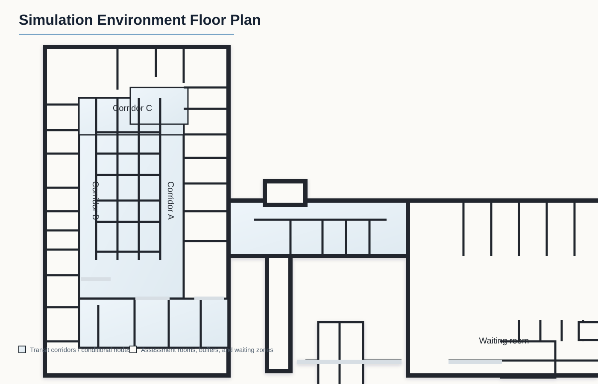
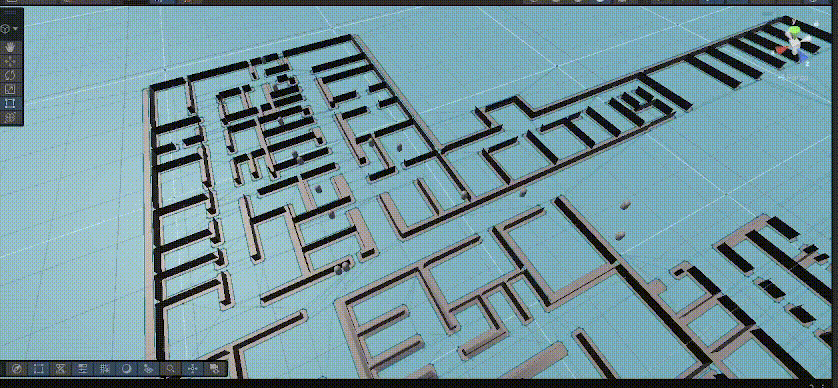

# Environment-Mediated GOAP for Dynamic Triage Transport

This repository contains a Unity-based triage transport simulation comparing an environment-mediated GOAP replanning controller against three baseline controllers:

- FSM / reactive controller
- Priority queue dispatcher
- Decision table controller
- Proposed environment-mediated GOAP replanner

The main research question is whether online replanning through shared environmental mediation can reduce critical-patient access delay without collapsing overall throughput under dense patient arrivals.

## Simulation Environment

The simulated environment contains a waiting room, two assessment wings, conditional corridor nodes, alternative detours, and shared assessment cubicles. Corridors and resources can be opened, closed, or filtered by patient state, priority, queue position, occupancy, and current flow-control mode.



## Emergency Fallback Demo

When a corridor or exit becomes unavailable during transport, agents that cannot continue their current route move to the nearest emergency waiting area instead of blocking the corridor. When the route becomes available again, they resume the controller-specific behavior.



## Method Summary

The proposed controller uses GOAP planning, but the planner does not operate on a static map. A mediator observes queues, resource occupancy, and transport conflicts, then updates shared world state and resource accessibility. Agents with different priorities evaluate the same environment differently because corridor and resource nodes apply conditional access filters.

If an action target becomes invalid during execution, the current plan is rolled back, reserved resources are released, and the agent waits for a world-state version change before requesting a new plan. This creates an online replanning loop without forcing every agent to replan every frame.

## Workload

The workload is a **MIMIC-IV-ED demo-informed synthetic triage transport trace**. It should not be presented as a full MIMIC-IV-ED cohort or as clinical validation data. The demo-informed package is used to reproduce emergency-department-style arrival and triage metadata for a transport-control experiment.

Key workload parameters:

- 300 scheduled patients per run
- 67 critical patients and 233 normal patients
- 30 assessment cubicles split across two wings
- Triage/contact duration bounded to 2-5 minutes
- Load multipliers: 1.00, 1.25, 1.50, 2.00
- Simulation stops when all scheduled patients reach home

Standalone workload files are available in [`docs/dataset`](docs/dataset/).

## Results Page

The GitHub Pages summary is in [`docs/index.html`](docs/index.html). It includes architecture diagrams, distribution plots, line charts, exported tables, and the supplementary dataset links.

To publish it through GitHub Pages:

1. Push this repository to GitHub.
2. Open **Settings** for the repository.
3. Open **Pages**.
4. Select **Deploy from a branch**.
5. Choose your branch, then select the `/docs` folder.
6. Save the settings.

After GitHub finishes deployment, the page will appear at the Pages URL shown in the same settings panel.

## Main Result Pattern

The proposed controller shows a load-dependent behavior. At lighter loads it introduces some overhead because it preserves critical access and uses more world-state updates. At the densest workload, the same mediation reduces critical access delay and slightly improves overall completion relative to the strongest baseline.

Dense workload highlights:

- Proposed GOAP completion time: 50.81 min
- Best baseline completion time: 50.83 min
- Proposed critical mean time to assessment: 1.35 min
- Best baseline critical mean time to assessment: 1.55 min
- Proposed critical P95 time to assessment: 2.61 min
- Best baseline critical P95 time to assessment: 3.24 min

## Repository Structure

```text
docs/
  index.html                     GitHub Pages results summary
  assets/                        Figures, architecture diagrams, and floor plan
  dataset/                       Supplementary synthetic workload package
analysis_outputs/                Exported analysis tables and plots
tools/                           Dataset and figure generation scripts
```

## Scope Note

This project evaluates patient transport and dynamic routing behavior in simulation. It does not validate clinical triage policy, patient outcomes, or real emergency-department treatment quality.
